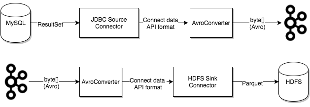

- [1. Kafka Connect 简介](#1-kafka-connect-简介)
- [2. Kafka Connect 概念](#2-kafka-connect-概念)
  - [2.1 Connectors](#21-connectors)
  - [2.2 Tasks](#22-tasks)
  - [2.3 Workers](#23-workers)
  - [2.4 Converters](#24-converters)
  - [2.5 Transforms](#25-transforms)
  - [2.6 Dead Letter Queue](#26-dead-letter-queue)
- [3. Kafka Connect Elasticsearch 实践](#3-kafka-connect-elasticsearch-实践)
  - [3.1 connect-standalone.properties](#31-connect-standaloneproperties)
  - [3.2 elasticsearch-sink.properties](#32-elasticsearch-sinkproperties)
  - [3.3 Start Kafka Connect](#33-start-kafka-connect)
  - [3.4 Monitoring Kafka Connect anf Connectors](#34-monitoring-kafka-connect-anf-connectors)
    - [3.4.1 Get worker cluster ID, version, and git source code commit ID](#341-get-worker-cluster-id-version-and-git-source-code-commit-id)
    - [3.4.2 List the connector plugins available on a worker](#342-list-the-connector-plugins-available-on-a-worker)
    - [3.4.3 List active connectors on a worker](#343-list-active-connectors-on-a-worker)
    - [3.4.4 Create a new connector, returning the current connector info if successful. Return 409 (Conflict) if rebalance is in process.](#344-create-a-new-connector-returning-the-current-connector-info-if-successful-return-409-conflict-if-rebalance-is-in-process)
    - [3.4.5 Restart a connector (there is no output if the command is successful)](#345-restart-a-connector-there-is-no-output-if-the-command-is-successful)
    - [3.4.6 Get connector tasks](#346-get-connector-tasks)
    - [3.4.7 Restart a task (there is no output if the command is successful)](#347-restart-a-task-there-is-no-output-if-the-command-is-successful)
    - [3.4.8 Pause a connector (there is no output if the command is successful)](#348-pause-a-connector-there-is-no-output-if-the-command-is-successful)
    - [3.4.9 Resume a paused connector (there is no output if the command is successful)](#349-resume-a-paused-connector-there-is-no-output-if-the-command-is-successful)
    - [3.4.10 Update the connector configuration, updates tasks from 1 to 2.](#3410-update-the-connector-configuration-updates-tasks-from-1-to-2)
    - [3.4.11 Get connector tasks status](#3411-get-connector-tasks-status)
- [4. 使用 JMX 监控 Kafka Connect](#4-使用-jmx-监控-kafka-connect)
  - [4.1 使用 JConsole 查看 JMX Metrics](#41-使用-jconsole-查看-jmx-metrics)
- [5. 使用 Prometheus JMX Exporter 收集 Kafka Connect JMX Metrics](#5-使用-prometheus-jmx-exporter-收集-kafka-connect-jmx-metrics)
  - [5.1 Prometheus JMX Exporter](#51-prometheus-jmx-exporter)
  - [5.2 使用 Prometheus 展示 Kafka Connect JMX Metrics](#52-使用-prometheus-展示-kafka-connect-jmx-metrics)
- [6. 参考资料](#6-参考资料)

## 1. Kafka Connect 简介

Kafka 0.9+ 增加了一个新的特性 `Kafka Connect`，可以更方便的创建和管理数据流管道。它为 Kafka 和其它系统创建规模可扩展的、可信赖的流数据提供了一个简单的模型，通过`Connectors` 可以将大数据从其它系统导入到 Kafka 中，也可以从 Kafka 中导出到其它系统。Kafka Connect 可以将完整的存储系统中的数据注入到 Kafka 的 Topic 中，或者将服务器的系统监控指标注入到 Kafka，然后像正常的 Kafka 流处理机制一样进行数据流处理。而导出工作则是将数据从 Kafka Topic 中导出到其它数据存储系统、查询系统或者离线分析系统等，比如 MySQL、MongoDB、Elasticsearch、 Cassandra、Ignite 等。

`Kafka Connect` 特性包括：
* Kafka Connector 通用框架，提供统一的集成 API
* 同时支持分布式模式和单机模式
* REST API，用来查看和管理 Kafka Connectors
* 自动化的 offset 管理，开发人员不必担心错误处理的影响
* 分布式、可扩展
* 流处理和批处理集成

Kafka 背后的商业公司 Confluent 鼓励社区创建更多的开源的 Connector，将 Kafka 生态圈壮大起来，促进 Kafka Connnect 的应用。

Kafka Connnect 有两个核心概念：Source 和 Sink。 Source 负责导入数据到 Kafka，Sink 负责从 Kafka 导出数据，它们都被称为 Connector。


当前 Kafka Connect 支持两种分发担保：at least once (至少一次) 和 at most once(至多一次)，exactly once 将在未来支持。

Connectors 的发布和开发可以参照官方文档。如果以前你通过 producer API / consumer API 写了一些导入导出的功能，不妨尝试一下换成 Kafka Connect，看看是否简化了你的代码，提高了应用可扩展和容错的能力。

## 2. Kafka Connect 概念

Kafka Connect 的几个重要的概念包括：Connectors、Tasks、Workers、Converters、Transforms。

* Connectors: 通过管理任务来细条数据流的高级抽象
* Tasks: 数据写入kafka和数据从kafka读出的实现
* Workers: 运行connectors和tasks的进程
* Converters: Kafka Connect 和其他存储系统直接发送或者接受数据之间转换数据
* Transforms: 更改 Connector 产生的或发送到 Connector 的每个消息的简单处理逻辑
* Dead Letter Queue: Kafka Connect 如何处理 Connector 错误

### 2.1 Connectors
在 kafka connect 中，connector 决定了数据应该从哪里复制过来以及数据应该写入到哪里去，一个 connector 实例是一个需要负责在 kafka 和其他系统之间复制数据的逻辑作业，connector plugin 是 jar 文件，实现了 kafka 定义的一些接口来完成特定的任务。


### 2.2 Tasks
task 是 kafka connect 数据模型的主角，每一个 connector 都会协调一系列的 task 去执行任务，connector 可以把一项工作分割成许多的 task，然后再把 task 分发到各个 worker 中去执行（分布式模式下），task 不自己保存自己的状态信息，而是交给特定的 kafka topic 去保存（config.storage.topic 和 status.storage.topic）。在分布式模式下有一个概念叫做任务再平衡（Task Rebalancing），当一个 connector 第一次提交到集群时，所有的 worker 都会做一个 task rebalancing 从而保证每一个 worker 都运行了差不多数量的工作，而不是所有的工作压力都集中在某个 worker 进程中，而当某个进程挂了之后也会执行 task rebalance。


当 Connector 首次提交到集群时，Worker 将重新平衡集群中的全部 Connectors 及其 Tasks，以便每个 Worker 具有大致相同的工作量。当 Connector 增加或减少它们需要的任务数量，或者 Connector 的配置发生更改时，也会使用相同的重新平衡过程。当一个 Worker 失败时，task 将在活动的 worker 之间重新进行平衡。当 task 失败时，不会触发再平衡，因为 task 失败被视为异常情况。因此，失败的 task 不会由框架自动重新启动，而应该通过 REST API 重新启动。


### 2.3 Workers
connectors 和 tasks 都是逻辑工作单位，必须安排在进程中执行，而在 kafka connect 中，这些进程就是 workers，分别有两种 worker: standalone 和 distributed。这里不对 standalone 进行介绍，具体的可以查看官方文档。我个人觉得 distributed worker 很棒，因为它提供了可扩展性以及自动容错的功能，你可以使用一个 group.ip 来启动很多 worker 进程，在有效的 worker 进程中它们会自动的去协调执行 connector 和 task，如果你新加了一个 worker 或者挂了一个 worker，其他的 worker 会检测到然后在重新分配 connector 和 task。


### 2.4 Converters
converter 会把 bytes 数据转换成 kafka connect 内部的格式，也可以把 kafka connect 内部存储格式的数据转变成 bytes，converter 对 connector 来说是解耦的，所以其他的 connector 都可以重用，例如，使用了 avro converter，那么 jdbc connector 可以写 avro 格式的数据到 kafka，当然，hdfs connector 也可以从 kafka 中读出 avro 格式的数据。

Confluent Platform 提供了以下 Converters:
* `AvroConverter`: io.confluent.connect.avro.AvroConverter: use with `Schema Registry`
* `ProtobufConverter`: io.confluent.connect.protobuf.ProtobufConverter: use with `Schema Registry`
* `JsonSchemaConverter`: io.confluent.connect.json.JsonSchemaConverter: use with `Schema Registry`
* `JsonConverter`: org.apache.kafka.connect.json.JsonConverter (without `Schema Registry`): use with structured data
* `StringConverter`: org.apache.kafka.connect.storage.StringConverter: simple string format
* `ByteArrayConverter`: org.apache.kafka.connect.converters.ByteArrayConverter: provides a “pass-through” option that does no conversion



### 2.5 Transforms

Connector 可以配置 Transforms 来对单个消息进行简单而轻量级的修改。这对于较小的数据调整和事件路由来说非常方便，并且多个 Transforms 可以在 Connectors 配置中链接在一起。但是，应用于多个消息的更复杂的转换和操作最好使用 ksqlDB 和 Kafka 流实现。

Transforms 是一个简单的函数，它接受一条记录作为输入并输出修改后的记录。Kafka Connect 提供的所有转换都执行简单但通常有用的修改。注意，您可以使用自己的自定义逻辑实现转换接口，将它们打包为 Kafka Connect 插件，并与任何 Connectors 一起使用它们。

Kafka Connect Transformations:

| Transform | Description |
| --------- | --- |
| Cast	| Cast fields or the entire key or value to a specific type (for example, to force an integer field to a smaller width). |
| Drop	| Drop either a key or a value from a record and set it to null. |
| ExtractField	| Extract the specified field from a Struct when schema present, or a Map in the case of schemaless data. Any null values are passed through unmodified. |
| ExtractTopic	| Replace the record topic with a new topic derived from its key or value. |
| Filter	| Include or drop records that match the filter.condition predicate. |
| Flatten	| Flatten a nested data structure. This generates names for each field by concatenating the field names at each level with a configurable delimiter character. |
| HoistField	| Wrap data using the specified field name in a Struct when schema present, or a Map in the case of schemaless data. |
| InsertField	| Insert field using attributes from the record metadata or a configured static value. |
| MaskField	| Mask specified fields with a valid null value for the field type. |
| MessageTimeStampRouter    | Update the record’s topic field as a function of the original topic value and the record’s timestamp field. |
| RegexRouter	| Update the record topic using the configured regular expression and replacement string. |
| ReplaceField	| Filter or rename fields. |
| SetSchemaMetadata	| Set the schema name, version, or both on the record’s key or value schema. |
| TimestampConverter	| Convert timestamps between different formats such as Unix epoch, strings, and Connect Date and Timestamp types. |
| TimestampRouter	| Update the record’s topic field as a function of the original topic value and the record timestamp. |
| TombstoneHandler	| Manage tombstone records. A tombstone record is defined as a record with the entire value field being null, whether or not it has ValueSchema. |
| ValueToKey	| Replace the record key with a new key formed from a subset of fields in the record value. |

### 2.6 Dead Letter Queue

由于多种原因，可能会出现无效记录。举个栗子：一条记录到达以 JSON 格式序列化的 Sink Connector，但 Sink Connector 配置期望的是 Avro 格式。当 Sink Connector 无法处理无效记录时，将根据 Connector 配置属性 `errors.tolerance` 处理该错误。

当 `errors.tolerance: none` 无效的记录会导致 Connector task 立即失败，Connector 进入失败状态。要解决这个问题，您需要检查 Kafka Connect Worker 日志，找出导致故障的原因，纠正它，并重新启动 Connector。

当 `errors.tolerance: all`，忽略所有错误或无效记录，继续处理。Connect Worker 日志中没有写入错误。要确定记录是否失败，您必须使用 `internal metrics` 或计算错误记录数量，并将其与已处理的记录数量进行比较。

可用的错误处理特性是将所有无效记录路由到一个特殊 Kafka Topic。此 Topic 包含 Sink Connector 无法处理的死信记录队列。

即使死信主题包含失败的记录，它也不会显示原因。您可以添加以下附加配置属性来包括失败的记录头信息。
```json
errors.deadletterqueue.context.headers.enable = true
```
当此参数设置为 true(默认为false)时，记录头被添加到死信队列中。然后可以使用 `kafkacat Utility` 查看记录头，并确定记录失败的原因。

为了避免与原始记录头冲突，死信队列上下文头键开始 `_connect.errors`。

举一个 Sink Connector 配置的栗子：
```json
 {
  "name": "gcs-sink-01",
  "config": {
    "connector.class": "io.confluent.connect.gcs.GcsSinkConnector",
    "tasks.max": "1",
    "topics": "gcs_topic",
    "gcs.bucket.name": "<my-gcs-bucket>",
    "gcs.part.size": "5242880",
    "flush.size": "3",
    "storage.class": "io.confluent.connect.gcs.storage.GcsStorage",
    "format.class": "io.confluent.connect.gcs.format.avro.AvroFormat",
    "partitioner.class": "io.confluent.connect.storage.partitioner.DefaultPartitioner",
    "value.converter": "io.confluent.connect.avro.AvroConverter",
    "value.converter.schema.registry.url": "http://localhost:8081",
    "schema.compatibility": "NONE",
    "confluent.topic.bootstrap.servers": "localhost:9092",
    "confluent.topic.replication.factor": "1",
    "errors.tolerance": "all",
    "errors.deadletterqueue.topic.name": "dlq-gcs-sink-01",
    "errors.deadletterqueue.context.headers.enable":true
  }
}
```

## 3. Kafka Connect Elasticsearch 实践

接下来梳理下 `kafka-connect-elasticsearch` 过程中的一些使用经验，如果是自己玩玩你可以使用 `Confluent` 全家桶，大家都知道 `Confluent` 是当初 Linkin 的几位 kafka 核心开发者创业成立的公司，致力于 kafka 的商业化，该团队基于 kafka 给社区贡献了几个优质的开源项目 `Schema Registry`、`Kafka Rest`、`KSQL`，还有很多 kafka connectors 组件。`Confluent` 包含了从 kafka 集群搭建到 connector 组件部署，再到 connect 监控的一站式集成，使用非常方便，但是核心的 `Confluent Control Center` 及周边支持是企业版才有的特性，免费版只能试用一段时间，而且功能特性还有限制，社区版功能更是甚少，所以准备自己搭建监控平台。

先从 `Confluent Hub` 下载 `kafka-connect-elasticsearch` 组件，为了方便管理，建议跟 kafka connect 在相同目录下，我使用的 `kafka_2.12-2.3.1` 版本，目录结构如下：


### 3.1 connect-standalone.properties

`connect-standalone` config 配置了 kafka broker 地址、消息 key 和 value converter 格式、offset 存储位置、connectors 加载目录等基本信息，更详细参数参考官网。

```sh
# These are defaults. This file just demonstrates how to override some settings.
bootstrap.servers=localhost:9092

# The converters specify the format of data in Kafka and how to translate it into Connect data. Every Connect user will
# need to configure these based on the format they want their data in when loaded from or stored into Kafka
key.converter=org.apache.kafka.connect.storage.StringConverter
value.converter=org.apache.kafka.connect.json.JsonConverter
key.converter.schemas.enable=false
value.converter.schemas.enable=false

offset.storage.file.filename=/denv/kafka_2.12-2.3.1/connectors/kafka-connect-elasticsearch/connect.offsets
offset.flush.interval.ms=5000

# Set to a list of filesystem paths separated by commas (,) to enable class loading isolation for plugins
# (connectors, converters, transformations). The list should consist of top level directories that include 
# any combination of: 
# a) directories immediately containing jars with plugins and their dependencies
# b) uber-jars with plugins and their dependencies
# c) directories immediately containing the package directory structure of classes of plugins and their dependencies
# Note: symlinks will be followed to discover dependencies or plugins.
# plugin.path=/usr/local/share/java,/usr/local/share/kafka/plugins,/opt/connectors
plugin.path=/denv/kafka_2.12-2.3.1/connectors
```

### 3.2 elasticsearch-sink.properties

`elasticsearch-sink` config 配置 ElasticsearchSinkConnector 相关配置，consumer name、topics name、Elasticseatch Rest API、Index Type 等，更详细参数参考官网。

```sh
name=elasticsearch-sink
connector.class=io.confluent.connect.elasticsearch.ElasticsearchSinkConnector
tasks.max=1
topics=test-elasticsearch-sink
key.ignore=false
schema.ignore=true
connection.url=http://127.0.0.1:9200
type.name=_doc
behavior.on.malformed.documents=warn
behavior.on.null.values=ignore
```

### 3.3 Start Kafka Connect

以 `standalone` 模式启动 `kafka connect`：
```sh
bin/connect-standalone.sh config/connect-standalone.properties connectors/kafka-connect-elasticsearch/etc/elasticsearch-sink.properties
```

### 3.4 Monitoring Kafka Connect anf Connectors

kafka connect 提供了 Rest API 用来监控 Connector 和 Task 状态。举几个栗子：

#### 3.4.1 Get worker cluster ID, version, and git source code commit ID

```sh
curl localhost:8083/ | jq

# response
{
  "version": "5.5.0-ce",
  "commit": "2bedb2c6980ba7a8",
  "kafka_cluster_id": "wxOOb2vrTPCLJl28PI18KA"
}
```

#### 3.4.2 List the connector plugins available on a worker

```sh
curl localhost:8083/connector-plugins | jq

# response
[
  {
    "class": "io.confluent.connect.elasticsearch.ElasticsearchSinkConnector",
    "type": "sink",
    "version": "5.5.1"
  },
  {
    "class": "org.apache.kafka.connect.file.FileStreamSinkConnector",
    "type": "sink",
    "version": "2.3.1"
  },
  {
    "class": "org.apache.kafka.connect.file.FileStreamSourceConnector",
    "type": "source",
    "version": "2.3.1"
  }
]
```

#### 3.4.3 List active connectors on a worker

```sh
curl localhost:8083/connectors | jq

# response
[
  "elasticsearch-sink"
]
```

#### 3.4.4 Create a new connector, returning the current connector info if successful. Return 409 (Conflict) if rebalance is in process.

```sh
curl -X POST localhost:8083/connectors -H 'Content-Type: application/json' -d'{
  "name": "elasticsearch-sink-test",
  "config": {
        "connector.class": "io.confluent.connect.elasticsearch.ElasticsearchSinkConnector",
        "type.name": "_doc",
        "behavior.on.malformed.documents": "warn",
        "behavior.on.null.values": "ignore",
        "topics": "test-elasticsearch-sink",
        "tasks.max": "1",
        "name": "elasticsearch-sink-test",
        "connection.url": "http://127.0.0.1:9200",
        "key.ignore": "true",
        "schema.ignore": "true"
    }
}'
```

#### 3.4.5 Restart a connector (there is no output if the command is successful)

```sh
curl -X POST localhost:8083/connectors/elasticsearch-sink/restart
```

#### 3.4.6 Get connector tasks

```sh
curl localhost:8083/connectors/elasticsearch-sink/tasks | jq

# response
[
  {
    "id": {
      "connector": "elasticsearch-sink",
      "task": 0
    },
    "config": {
      "connector.class": "io.confluent.connect.elasticsearch.ElasticsearchSinkConnector",
      "type.name": "_doc",
      "behavior.on.malformed.documents": "warn",
      "behavior.on.null.values": "ignore",
      "task.class": "io.confluent.connect.elasticsearch.ElasticsearchSinkTask",
      "topics": "test-elasticsearch-sink",
      "tasks.max": "1",
      "name": "elasticsearch-sink",
      "connection.url": "http://127.0.0.1:9200",
      "key.ignore": "false",
      "schema.ignore": "true"
    }
  }
]
```

#### 3.4.7 Restart a task (there is no output if the command is successful)

```sh
curl -X POST localhost:8083/connectors/elasticsearch-sink/tasks/0/restart
```

#### 3.4.8 Pause a connector (there is no output if the command is successful)

```sh
curl -X PUT localhost:8083/connectors/elasticsearch-sink/pause
```

#### 3.4.9 Resume a paused connector (there is no output if the command is successful)

```sh
curl -X PUT localhost:8083/connectors/elasticsearch-sink/resume
```

#### 3.4.10 Update the connector configuration, updates tasks from 1 to 2.

```sh
curl -X PUT localhost:8083/connectors/elasticsearch-sink/config -H 'Content-Type: application/json' -d'{
  "connector.class": "io.confluent.connect.elasticsearch.ElasticsearchSinkConnector",
  "type.name": "_doc",
  "behavior.on.malformed.documents": "warn",
  "behavior.on.null.values": "ignore",
  "topics": "test-elasticsearch-sink",
  "tasks.max": "2",
  "name": "elasticsearch-sink",
  "connection.url": "http://127.0.0.1:9200",
  "key.ignore": "true",
  "schema.ignore": "true"
}'
```

#### 3.4.11 Get connector tasks status

```sh
curl localhost:8083/connectors/elasticsearch-sink/status | jq

# response
{
  "name": "elasticsearch-sink",
  "connector": {
    "state": "RUNNING",
    "worker_id": "127.0.0.1:8083"
  },
  "tasks": [
    {
      "id": 0,
      "state": "RUNNING",
      "worker_id": "127.0.0.1:8083"
    },
    {
      "id": 1,
      "state": "RUNNING",
      "worker_id": "127.0.0.1:8083"
    }
  ],
  "type": "sink"
}
```

## 4. 使用 JMX 监控 Kafka Connect

使用 kafka 做消息队列中间件时，为了实时监控其性能时，免不了要使用 jmx 调取 kafka broker 的内部数据，不管是自己重新做一个 kafka 集群的监控系统，还是使用一些开源的产品，比如 yahoo 的kafka manager, 其都需要使用 jmx 来监控一些敏感的数据。在 kafka 官网中 `http://kafka.apache.org/082/documentation.html#monitoring` 这样说：

> Kafka uses Yammer Metrics for metrics reporting in both the server and the client. This can be configured to report stats using pluggable stats reporters to hook up to your monitoring system.
> The easiest way to see the available metrics to fire up jconsole and point it at a running kafka client or server; this will all browsing all metrics with JMX.

可见 kafka 官方也是提倡使用 jmx，并且提供了 jmx 的调用给用户以监控 kafka.

在使用 jmx 之前需要确保 kafka 开启了 jmx 监控，kafka 启动时要添加 `JMX_PORT=9999` 参数：

```sh
JMX_PORT=9999 bin/connect-standalone.sh config/connect-standalone.properties connectors/kafka-connect-elasticsearch/etc/elasticsearch-sink.properties
```

### 4.1 使用 JConsole 查看 JMX Metrics

启动 JConsole 并连接 Kafka Connect JMX:


查看 Kafka Connect JMX Metrics:


## 5. 使用 Prometheus JMX Exporter 收集 Kafka Connect JMX Metrics

Prometheus 是一个监视工具，可以提取指标，使其成为图形，然后将其公开给 Alert Manager，后者可以使用多种方法发送警报。它从 HTTP 端点提取指标，该指标已添加到Prometheus 配置文件中。因此，我们需要一种以 Prometheus 理解的格式通过 HTTP 公开 Kafka Connect Metrics 的方法。

### 5.1 Prometheus JMX Exporter

Prometheus 提供了 JMX Exporter，它是 "可以配置地抓取和公开 JMX Metrics 的 `mBean` 的收集器"。它以 Prometheus 可以理解的格式通过 HTTP 服务器公开了我们在上述工具中看到的 JMX Metrics。

JMX Exporter 可以两种模式之一运行，作为注入您要监视的应用程序的 Java Agent，或作为连接到我们公开的 JMX 端口的独立进程。作为注入的 Java Agent 运行它会暴露更多的CPU和内存指标，更易于为某些应用程序配置，并且在有大量指标时性能损耗得多。在这种情况下，我们选择将 JMX Exporter 作为单独的进程运行，因为我们可以更轻松地重用现有的 Chef 代码并且因为它更易于开发，这就是我们在生产中监视 Kafka Connect 和 Kafka Mirror Maker 的方式。但是，在具有数百个 Topics 的 Kafka Broker 上，这种运行 JMX Exporter 的方法效果不佳，在这种情况下，我们选择注入 Java Agent。

解析 JMX 度量标准名称和值有些不可思议，这通常是整个设置过程中最难的部分。重要的是键的顺序很重要，并且 JMX Dump 不会保留顺序，JMX Dump 的输出可轻松浏览可用的指标。
一个良好的起点是使用 JMX Dump 来发现可能的最高级别指标。

所有的 Kafka 服务，包括 Kafka Connect，都以 `kafka` 开头公开 JMX Metrics，因此这是作为 JMX Exporter 模式的一个很好的起点。以下配置是获取 JMX Exporter 公开Kafka Connect JMX Metrics 所需的最低配置：

```yaml
hostPort: 127.0.0.1:9999   # jmx_port
lowercaseOutputName: true
# whitelistObjectNames:
#     - kafka.connect:type=connector-metrics,connector="{connector}"
#     - kafka.connect:type=connector-task-metrics,connector="{connector}",task="{task}"
#     - kafka.connect:type=source-task-metrics,connector=([-.w]+),task=([d]+)
#     - kafka.connect:type=sink-task-metrics,connector=([-.w]+),task=([d]+)
#     - kafka.connect:type=connect-metrics,client-id=
#     - kafka.consumer:type=consumer-fetch-manager-metrics,client-id=([-.w]+)
#     - kafka.consumer:type=consumer-node-metrics,client-id=([-.\w]+),node-id=([0-9]+)
ssl: false
rules:
  - pattern: kafka*
```

接下来我们改造下 `connect-standalone` 启动脚本，以 Java Agent 的方式注入 `Prometheus JMX Exporter`:

```sh
# jmx port
export JMX_PORT="9999"

# jmx prometheus exporter
export KAFKA_OPTS="-javaagent:/denv/kafka_2.12-2.3.1/exporter/jmx_prometheus_javaagent-0.13.0.jar=19999:/denv/kafka_2.12-2.3.1/exporter/jmx-connector-metrics.yaml"

if [ $# -lt 1 ];
then
        echo "USAGE: $0 [-daemon] connect-standalone.properties"
        exit 1
fi

base_dir=$(dirname $0)

if [ "x$KAFKA_LOG4J_OPTS" = "x" ]; then
    export KAFKA_LOG4J_OPTS="-Dlog4j.configuration=file:$base_dir/../config/connect-log4j.properties"
fi

if [ "x$KAFKA_HEAP_OPTS" = "x" ]; then
  export KAFKA_HEAP_OPTS="-Xms256M -Xmx2G"
fi

EXTRA_ARGS=${EXTRA_ARGS-'-name connectStandalone'}

COMMAND=$1
case $COMMAND in
  -daemon)
    EXTRA_ARGS="-daemon "$EXTRA_ARGS
    shift
    ;;
  *)
    ;;
esac

exec $(dirname $0)/kafka-run-class.sh $EXTRA_ARGS org.apache.kafka.connect.cli.ConnectStandalone "$@"
```

再次启动 `connect-standalone`:

```sh
bin/connect-standalone.sh config/connect-standalone.properties connectors/kafka-connect-elasticsearch/etc/elasticsearch-sink.properties
```

此时，已经可以通过 Rest API `http://127.0.0.1:19999/metrics` 查看 JMX Metrics 了，截取了部分 Metrics 的时序数据如下：

```yaml
# HELP kafka_connect_sink_task_metrics_put_batch_max_time_ms The maximum time taken by this task to put a batch of sinks records. (kafka.connect<type=sink-task-metrics, connector=elasticsearch-sink, task=0><>put-batch-max-time-ms)
# TYPE kafka_connect_sink_task_metrics_put_batch_max_time_ms untyped
kafka_connect_sink_task_metrics_put_batch_max_time_ms{connector="elasticsearch-sink",task="0",} 1.0
# HELP kafka_connect_connector_task_metrics_offset_commit_success_percentage The average percentage of this task's offset commit attempts that succeeded. (kafka.connect<type=connector-task-metrics, connector=elasticsearch-sink, task=0><>offset-commit-success-percentage)
# TYPE kafka_connect_connector_task_metrics_offset_commit_success_percentage untyped
kafka_connect_connector_task_metrics_offset_commit_success_percentage{connector="elasticsearch-sink",task="0",} 1.0
# HELP kafka_consumer_consumer_node_metrics_outgoing_byte_rate The number of outgoing bytes per second (kafka.consumer<type=consumer-node-metrics, client-id=connector-consumer-elasticsearch-sink-0, node-id=node-2><>outgoing-byte-rate)
# TYPE kafka_consumer_consumer_node_metrics_outgoing_byte_rate untyped
kafka_consumer_consumer_node_metrics_outgoing_byte_rate{client_id="connector-consumer-elasticsearch-sink-0",node_id="node-2",} 583.7583041596604
kafka_consumer_consumer_node_metrics_outgoing_byte_rate{client_id="connector-consumer-elasticsearch-sink-0",node_id="node-1",} 551.6166430503672
kafka_consumer_consumer_node_metrics_outgoing_byte_rate{client_id="connector-consumer-elasticsearch-sink-0",node_id="node-2147483645",} 79.27704986853443
kafka_consumer_consumer_node_metrics_outgoing_byte_rate{client_id="connector-consumer-elasticsearch-sink-0",node_id="node--2",} 0.0
kafka_consumer_consumer_node_metrics_outgoing_byte_rate{client_id="connector-consumer-elasticsearch-sink-0",node_id="node-3",} 558.144991006491
# HELP kafka_connect_connect_worker_metrics_task_startup_success_percentage The average percentage of this worker's tasks starts that succeeded. (kafka.connect<type=connect-worker-metrics><>task-startup-success-percentage)
# TYPE kafka_connect_connect_worker_metrics_task_startup_success_percentage untyped
kafka_connect_connect_worker_metrics_task_startup_success_percentage 0.0
# HELP kafka_connect_sink_task_metrics_offset_commit_completion_rate The average per-second number of offset commit completions that were completed successfully. (kafka.connect<type=sink-task-metrics, connector=elasticsearch-sink, task=0><>offset-commit-completion-rate)
# TYPE kafka_connect_sink_task_metrics_offset_commit_completion_rate untyped
kafka_connect_sink_task_metrics_offset_commit_completion_rate{connector="elasticsearch-sink",task="0",} 0.10125386030342406
# HELP java_lang_g1_young_generation_lastgcinfo_duration CompositeType for GC info for G1 Young Generation (java.lang<name=G1 Young Generation, type=GarbageCollector><LastGcInfo>duration)
# TYPE java_lang_g1_young_generation_lastgcinfo_duration untyped
java_lang_g1_young_generation_lastgcinfo_duration{type="GarbageCollector",} 1.0
# HELP kafka_connect_task_error_metrics_deadletterqueue_produce_requests The number of attempted writes to the dead letter queue. (kafka.connect<type=task-error-metrics, connector=elasticsearch-sink, task=0><>deadletterqueue-produce-requests)
# TYPE kafka_connect_task_error_metrics_deadletterqueue_produce_requests untyped
kafka_connect_task_error_metrics_deadletterqueue_produce_requests{connector="elasticsearch-sink",task="0",} 0.0
# HELP java_nio_mapped_totalcapacity TotalCapacity (java.nio<name=mapped, type=BufferPool><>TotalCapacity)
# TYPE java_nio_mapped_totalcapacity untyped
java_nio_mapped_totalcapacity{type="BufferPool",} 0.0
# HELP kafka_connect_connector_task_metrics_running_ratio The fraction of time this task has spent in the running state. (kafka.connect<type=connector-task-metrics, connector=elasticsearch-sink, task=0><>running-ratio)
# TYPE kafka_connect_connector_task_metrics_running_ratio untyped
kafka_connect_connector_task_metrics_running_ratio{connector="elasticsearch-sink",task="0",} 1.0
```

### 5.2 使用 Prometheus 展示 Kafka Connect JMX Metrics

修改 `prometheus.yml`:

```sh
# my global config
global:
  scrape_interval:     5s # Set the scrape interval to every 15 seconds. Default is every 1 minute.
  evaluation_interval: 5s # Evaluate rules every 15 seconds. The default is every 1 minute.
  # scrape_timeout is set to the global default (10s).

# Alertmanager configuration
alerting:
  alertmanagers:
  - static_configs:
    - targets:
      # - alertmanager:9093

# Load rules once and periodically evaluate them according to the global 'evaluation_interval'.
rule_files:
  # - "first_rules.yml"
  # - "second_rules.yml"

# A scrape configuration containing exactly one endpoint to scrape:
# Here it's Prometheus itself.
scrape_configs:
  # The job name is added as a label `job=<job_name>` to any timeseries scraped from this config.
  - job_name: 'prometheus'

    # metrics_path defaults to '/metrics'
    # scheme defaults to 'http'.

    static_configs:
    # - targets: ['localhost:9990']
    - targets: ['127.0.0.1:19999']
```

启动 `Prometheus`:

```sh
./prometheus --config.file=prometheus.yml
```

访问 `Prometheus UI: http://127.0.0.1:9090/`，输入 `kafka_connect_*` 开头的指标，即可把 Prometheus Exporter 写入 TSDB 时序数据库中的 Metrics 图形化展示出来，随便选择了 2 个 Metrics 如下图所示：


如果你需要更丰富的图像化展示，可以把 Prometheus 作为数据源接入 Grafana，接入 Grafana 配置的几个 Kafka Connect Metrics 图形化展示如下图所示：


分享就到这里吧，如果还有不明白的地方，官方文档是最好的学习资料。

## 6. 参考资料

* [Kafka Ecosystem](https://cwiki.apache.org/confluence/display/KAFKA/Ecosystem)
* [Kafka Connect Concepts](https://docs.confluent.io/current/connect/concepts.html)
* [Kafka Connect Monitoring Documentation](https://kafka.apache.org/documentation/#connect_monitoring)
* [Monitoring Kafka Connect and Connectors](https://docs.confluent.io/current/connect/managing/monitoring.html)
* [Kafka Connect REST Interface](https://docs.confluent.io/current/connect/references/restapi.html#topics)
* [如何使用 JMX 监控 Kafka](https://honeypps.com/mq/how-to-monitor-kafka-with-jmx/)
* [Prometheus JMX Exporter](https://github.com/prometheus/jmx_exporter)
* [Confluent Schema Registry](https://docs.confluent.io/current/schema-registry/connect.html#schemaregistry-kafka-connect)
* [kafkacat Utility](https://docs.confluent.io/current/app-development/kafkacat-usage.html#kafkacat-usage)

