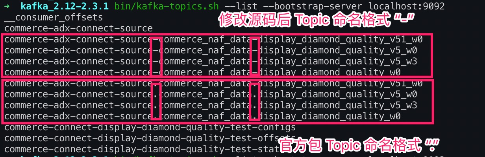

- [背景](#背景)
- [遇到的问题](#遇到的问题)
  - [基于开源项目打包无法被 Kafka Connect Plugins 机制加载](#基于开源项目打包无法被-kafka-connect-plugins-机制加载)
  - [阅读 Kafka Connect Plugin 加载机制源码](#阅读-kafka-connect-plugin-加载机制源码)
  - [尝试把修改源码的 class 文件重新更新到官方的 Release 包里](#尝试把修改源码的-class-文件重新更新到官方的-release-包里)
  - [尝试比对官方包和基于开源项目打包的差异](#尝试比对官方包和基于开源项目打包的差异)
  - [统一构建环境，重新构建 Connector Plugin 包](#统一构建环境重新构建-connector-plugin-包)
- [总结](#总结)

## 背景

砖展物料数据当前是采用 `Hive2MySQL T+1` 的方式同步到商业化流量分发侧，涉及 4张表 2亿条记录，砖展数据尝试迁移到ES集群，为了达到服务上线后的平滑迁移，在ES集群服务不可用时支持降级到原来的查询MySQL方案，所以，准备采用 `Hive2MySQL => MySQL2Kafka => Kafka2ES` 的数据流同步机制；目前公司提供的 MySQL2Kafka 的方案就是 EPX，该方案有以下缺陷：
* 延迟高
* 不支持库和表配置白名单（你可能只需要监听某个库的某张表的 binlog，而不是全部）
* 不支持根据表名路由 Kafka Topics
* 不支持 Message 结构化数据定制（因为 binglog 消息格式包含了 before, after, source 等数据结构，大多场景下你只需要 ExtractNewRecordState SMT 消息格式）

基于以上种种原因，采用复用 Kafka Connect 分布式集群的能力，新增 Debezium Connector MySQL Source Connector，关于 Debezium Stack 请 Google，不是本文的重点。

还有一个更完美的优点，`MySQL Source Connector` 配合 `Elasticsearch Sink Connector` 能完美的处理 `Binlog Delete Events`。`Source Connector` 可以把 `Binlog Delete Events` 对应的 `Kafka Message Value` 设置为 `null`，`Elasticsearch Sink Connector` 收到 Value: null 的消息是执行 Delete 操作，是不是很完美。

更重要的一点时，以上所说的种种能力，不需要写一行代码，更不需要开发一个缺少监控能力的 Standalone Consumer，这就是 Kafka Connect 生态的魅力。

## 遇到的问题

`Debezium MySQL Source Connector` 创建的 Topics 命名规范是：`serverName.databaseName.tableName`，连接符是 ”.“，而公司申请 Topics 是要求的规范是：以”-“分割，所以无法创建 Topics。所以准备采用修改 Debezium 团队的开源项目代码并自行打包（这个过程异常曲折，开源项目的 Release 流程规范都异常繁琐且各有千秋，参与过开源项目的小伙伴都懂）。打包完成之后，匪夷所思的问题发生了，后面的排查路线也很魔性，在跑偏的路上一去不返，不过整个过程下来还有挺有分享意义的。

问题现象是：自己打包的 Connector Plugins 无法被 Kafka Connect 集群加载，而官网的 Release Package 可以，百思不得其解，尝试了各种姿势：
* 跟 Debezium 项目保持一致的 打包环境和 Docker 环境；
* 研究 Debezium Connector 源码 和 Kafka Connect Plugins Load 相关源码；
* 反编译 Debezium 的包和自己的包并做对比；
* 把修改的代码的类文件编译的class文件重新打包进 Debezium Release Package 中；

各种姿势都尝试了，终于发现了蛛丝马迹，慢慢道来（最后发现是一个很弱智的低级错误）。

### 基于开源项目打包无法被 Kafka Connect Plugins 机制加载

为了准守公司 Kafka Topics 申请时的命名规范，修改 Debezium MySQL Source Connector 源码并进行打包，单测和集成测试均通过，按照 Release 规范完成了打包，但是无法被 Kafka Connect Plugins 机制加载，正常加载之后能通过 REST API 查看 Connectors 列表，如下：


自己打包后重启 Kafka Connect 集群，无法显示上图红框中的 Connector ，切换会官网的 Release 包能正常被加载。

### 阅读 Kafka Connect Plugin 加载机制源码

阅读 Kafka Connect Plugin 加载机制源码，未发现有什么特殊的校验逻辑，且插件包无法被加载时无错误日志输出。

### 尝试把修改源码的 class 文件重新更新到官方的 Release 包里

把官方 Release 包解压，把修改源码的 class 文件重新更新到官方的 Release 包里，保证目录结构一致，命令如下：

```sh
jar xvf debezium-connector-mysql-1.2.1.Final.jar
jar uf debezium-connector-mysql-1.2.1.Final.jar io/debezium/connector/mysql/
```

再次重启集群，发现 MySQL Connector 依然无法被成功加载。

### 尝试比对官方包和基于开源项目打包的差异

反编译官方包和基于开源项目构建的包，发现修改过的代码class文件核心逻辑一致，但是在异常处理地方不一致，基于开源项目构建的包异常处理更完整，最简单的判断逻辑是自己构建的包class文件比官方包多了十几行，因此判断可能是本地构建包的环境跟官方包的构建环境不一致。

查看官方包的信息摘要，如下：


查看基于开源项目构建包的信息摘要，如下：


发现官方包是基于 `Build-Jdk: 1.8.0_212`，基于开源项目构建的包是基于 `Build-Jdk: 11.0.2`，哦，这可能就是问题所在了。

由于我本地环境是使用`jenv`管理`jdk`版本，查看本地构建环境的版本信息，如下：

`jenv` 管理的`jdk`列表和当前生效的`jdk`版本，如下：


系统默认`jdk`版本，如下：


本地环境`mvn`构建环境依赖的`jdk`版本，如下：


这么一比对应该发现问题，系统默认`jdk`版本是`11`，使用`jenv`管理且当前生效的`jdk`版本是`1.8`，而`mvn`构建包依赖的`jdk`版本是`11`，也就是所出现了`jdk`版本不一致的问题，`jenv`并没有把本地所有依赖`jdk`的组件环境给统一。接下来修改`mvn`构建包依赖的`jdk`环境到`1.8`，作如下操作：

```sh
echo export "JAVA_HOME=\$(/usr/libexec/java_home -v 1.8)" >> .zshrc
source ~/.zshrc
```

### 统一构建环境，重新构建 Connector Plugin 包

再次查看`mvn`构建包依赖的`jdk`环境，如下：


发现修改已经生效了，重新基于开源项目构建包，并解压构建包，查看摘要，如下：


发现构建包是基于 `Build-Jdk: 1.8.0_212`了，跟官方包保持一致了。重启 Kafka Connect 集群，查看当前被加载的插件列表，如下：


果然，基于开源项目构建包的生效了。

创建`Debezium MySQL Connector`：
```sh
curl -X POST http://localhost:8089/connectors \
    -H 'Content-Type: application/json' \
    -H 'Accept: application/json' \
    -d @connectors/config/kafka-source-display-diamond-quality.json
```

Connector 配置文件，如下：
```json
{
    "name": "xxx-display-diamond-quality-source-test",
    "config": {
        "connector.class": "io.debezium.connector.mysql.MySqlConnector",
        "tasks.max": "1",
        "database.hostname": "127.0.0.1",
        "database.port": "3306",
        "database.user": "xxx_dev",
        "database.password": "xxx",
        "database.server.name": "xxx-adx-connect-source",
        "database.whitelist": "xxx_data",
        "table.whitlelist" : "xxx_data.diamond_quality_w0,xxx_data.diamond_quality_v5_w0,xxx_data.diamond_quality_v51_w0",
        "database.history.connector.id": "2323",
        "database.history.kafka.bootstrap.servers": "kafka04-test.xxx.com:9092,kafka05-test.xxx.com:9092,kafka06-test.xxx.com:9092",
        "database.history.kafka.topic": "xxx-adx-connect-source.xxx_data.table_structure_change_records",
        "include.schema.changes": "true",
        "incrementing.column.name": "id",
        "database.history.skip.unparseable.ddl": "true",
        "transforms": "unwrap",
        "transforms.unwrap.type": "io.debezium.transforms.ExtractNewRecordState",
        "transforms.unwrap.drop.tombstones": "true",
        "transforms.unwrap.delete.handling.mode": "none"
    }
}
```

查看 `Kafka Topics` 列表，如下：


发现，修改源码生成 kafka topic 的命名格式生效了。通过`kafka manager`查看如下：


砖展物料数据的4张表对应的4个`Topic`创建成功了。查看测试环境`Kafka Connect`集群监控`Connector`从`MySQL`写入`Kafka`的速率，如下：


发现测试环境单Topic写入速度瞬间达到 3万/秒，很快几张表的数据同步完成了。

## 总结

经过以上排查结果是，本地`mvn`构建包依赖的`jdk`版本跟官方包不一致导致`Kafka Connect Plugin`无法加载。

关于更多`Kafka Connect`的问题，请查看之前在TC写的文章：
https://mp.weixin.qq.com/s/hK7bRxnAI3DzK2ts2IUcaw

关于更多`Debezium MySQL Source Connector`的问题，请查看官方文档：
https://debezium.io/documentation/reference/1.2/

