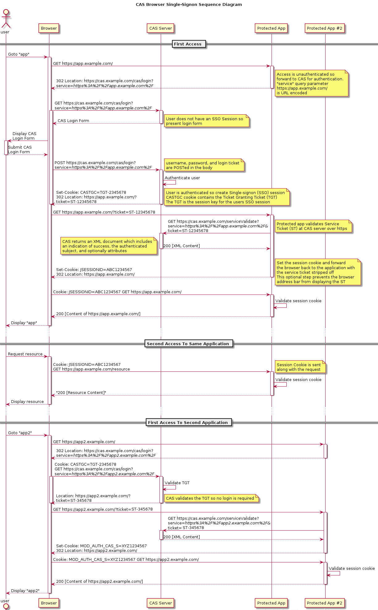
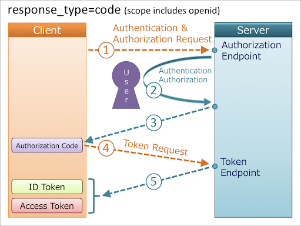
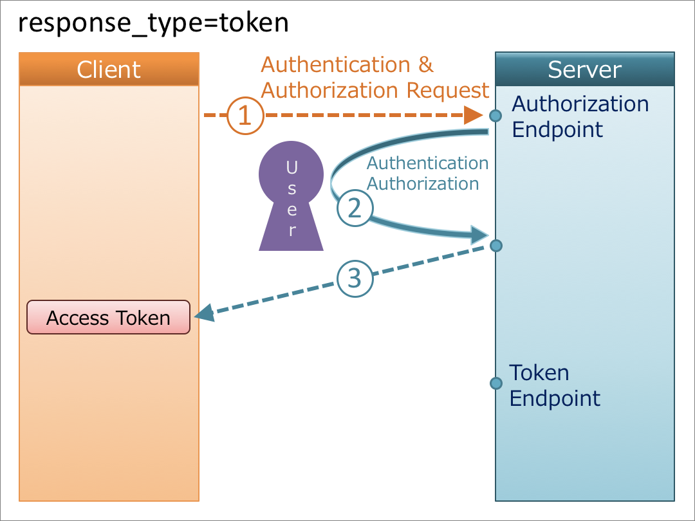
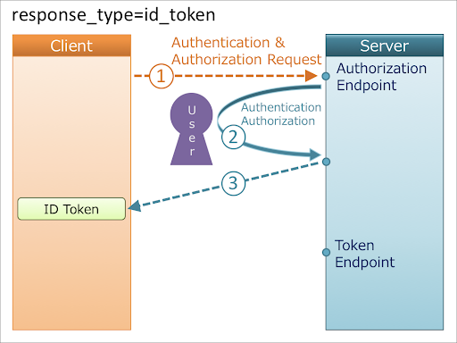
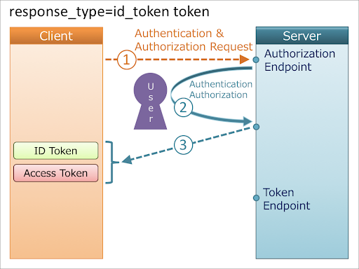
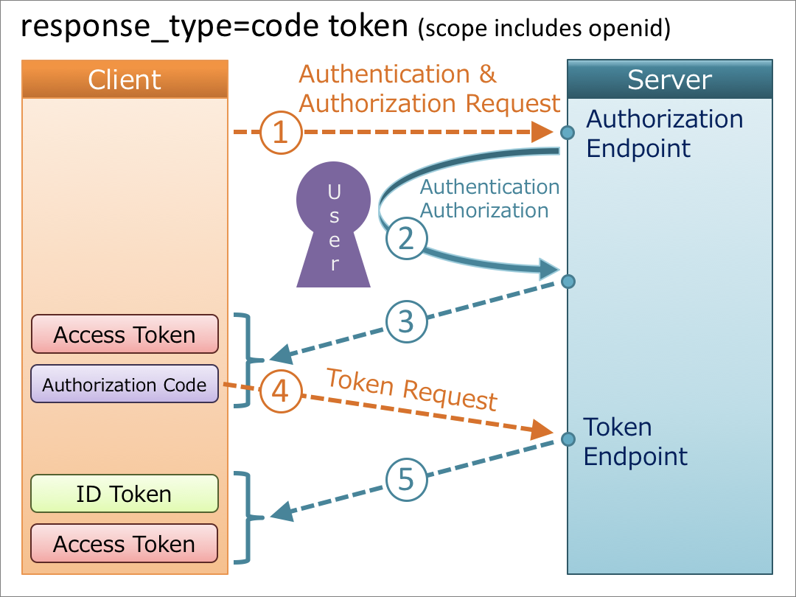
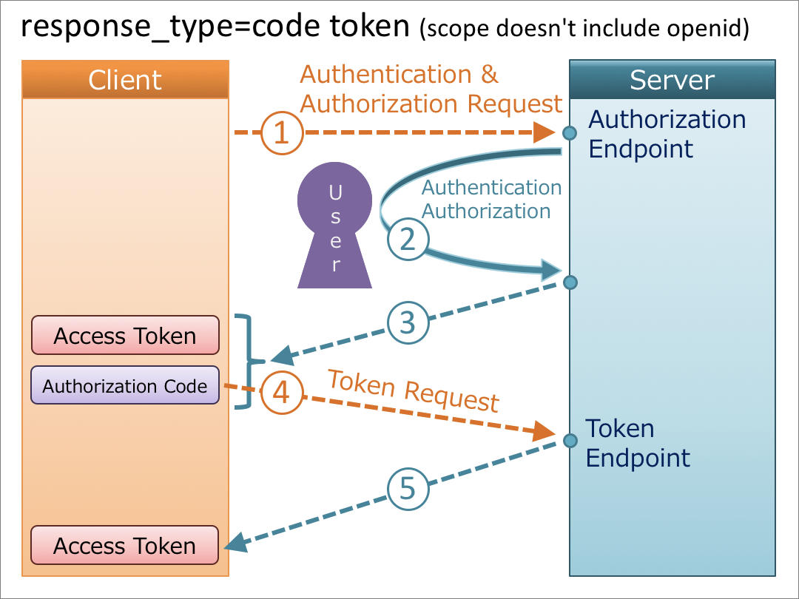
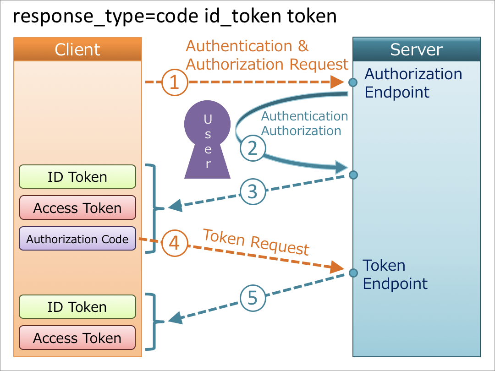

- [SSO: Single Sign On](#sso-single-sign-on)
  - [同域单点登录](#同域单点登录)
  - [跨域单点登录](#跨域单点登录)
- [OIDC: OpenID Connect](#oidc-openid-connect)
  - [OIDC 是什么](#oidc-是什么)
  - [ID Token](#id-token)
  - [授权](#授权)
  - [OIDC 流程](#oidc-流程)
    - [授权码模式](#授权码模式)
    - [隐身模式](#隐身模式)
    - [混合模式](#混合模式)
- [JWT: Json Web Tokens](#jwt-json-web-tokens)
  - [不要把 JWT 用作 Session](#不要把-jwt-用作-session)
  - [JWT 宣称的优点](#jwt-宣称的优点)
    - [易于水平扩展](#易于水平扩展)
    - [简单易用](#简单易用)
    - [更安全](#更安全)
    - [内置过期功能](#内置过期功能)
    - [可以防护 CSRF 攻击](#可以防护-csrf-攻击)
    - [在用户阻止了 Cookies 后还可以工作](#在用户阻止了-cookies-后还可以工作)
  - [JWT 的缺点](#jwt-的缺点)
    - [体积大](#体积大)
    - [不安全](#不安全)
    - [无法使某个 JWT 无效](#无法使某个-jwt-无效)
    - [Session 数据过期](#session-数据过期)
    - [JWT 适合的场景](#jwt-适合的场景)
- [参考资料](#参考资料)

## SSO: Single Sign On

### 同域单点登录

独立用户中心 uc.xxx.com 作为 SSO 服务，用户在 uc.xxx.com 登录时，在服务端的 session 中记录登录状态，同时在浏览器的 .xxx.com 即顶级域下写入 Cookie，此时所有子域的系统都可以访问顶域的 Cookie。

Session 在服务端采用多站点共享存储。

### 跨域单点登录

同域下的 SSO 是巧用了 Cookie 顶域的特性。如果是不同域呢？不同域之间 Cookie 是不共享的。

单点登录的标准 CAS 流程如下：

* 01.用户访问 Site A 时需要用户登录；跳转到 CAS Server 及 SSO 服务登录认证，将登录态写入 SSO 的 Session，浏览器中写入 SSO 域下的 Cookie；
* 02.SSO 系统登录完成后生成一个 ST: Service Ticket，然后跳转到 Site A，同时将 ST 作为参数传递给 Site A；
* 03.Site A 拿到 ST 后，从后台向 SSO 发送请求，验证 ST 是否有效；
* 04.验证通过后，Site A 将登录态写入 Session 并设置 Site A 域下的 Cookie。

至此，跨域单点登录就完成了；再次访问 Site A 时，就是登录态。然后，我们此时看访问 Site B 的流程：

* 01.用户访问 Site B，Site B 没有登录，跳转到 SSO；
* 02.由于 SSO 已经登录，不需要重新登录认证；
* 03.SSO 生成 ST，浏览器跳转到 Site B，并将 ST 作为参数传递给 Site B；
* 04.Site B 拿到 ST，后台访问 SSO，验证 ST 是否有效；
* 05.验证成功后，Site B 将登录态写入 Session，并在 Site B 域下写入 Cookie。

至此，Site B 不需要走登录流程，就已经是登录态了。Site A 和 B 在不同的域，他们之间的 Session 可以是服务端不共享存储。

## OIDC: OpenID Connect

### OIDC 是什么

简单来说：OIDC 是 OpenID Connect 的简称，OIDC=(Identity, Authentication) + OAuth 2.0。它在 OAuth 2.0 上构建了一个身份层，是一个基于 OAuth 2.0 协议的身份认证标准协议。我们都知道 OAuth 2.0 是一个授权协议，它无法提供完善的身份认证功能，OIDC 使用OAuth 2.0 的授权服务器来为第三方客户端提供用户的身份认证，并把对应的身份认证信息传递给客户端，且可以适用于各种类型的客户端（比如服务端应用，移动APP，JS应用），且完全兼容 OAuth 2.0，也就是说你搭建了一个 OIDC 的服务后，也可以当作一个 OAuth 2.0 的服务来用。应用场景如图：

### ID Token

id_token 是用户的身份标识，是一个 JWT Token，由 元信息、负载、签名 三部分组成。

元信息：有一些属性，用于描述本 id_token JWT 的签名算法，负载（payload）部分的类型等。

负载（payload）：有一些属性，用于描述被认证者的身份和本 token 的信息，比如用户 id，颁发时间，接收方等。

签名：元信息和 Payload 部分通过 . 连接，加上一个私钥进行摘要计算从而得到。如果 token 被篡改过，比如改变认证主体。那么服务器在本地计算的签名和 token 的 签名部分携带的签名就会不一致，从而拒绝请求。

### 授权

三方登录的实质是让用户同意其他应用访问他在你的服务器上的信息，然后你会生成一个 Access Token 给第三方，只要第三方拥有这个 Token，他就能代表用户访问此人在你的服务器上的数据。

### OIDC 流程

OIDC 是一套认证授权的规范，应用广泛，轻量简单，基于 OAuth 2.0，既可以用于授权，也可以用于身份认证。

id_token 用户认证；access_token 用户授权。

#### 授权码模式

授权码模式是最常用的 OIDC 模式，流程如下：

* 01.三方应用发起授权请求（需要访问这个用户在用户中心服务的数据）；
* 02.用户中心服务询问用户是否同意授权，要求用户输入用户名和密码，并弹出对方请求获取的信息条目；
* 03.用户中心服务返回一个授权码给三方应用前端或后端；
* 04.三方应用后端携带这个授权码向用户中心服务的 token 颁发接口请求数据；
* 05.用户中心服务返回 id_token 和 access_token。

接口|授权码|ID Token|Access Token
--|--|--|--
授权|颁发|X|X
Token|X|颁发|颁发

scope 不带 openid 的情况，最后不返回 id_token，流程如下：

#### 隐身模式

当发起授权请求时 query 参数 response_type=token 的时候，使用的是隐式模式。即使在 scope 中包含了 openid，id_token 也不会被返回。隐式模式可以一次请求，立刻获取到 access_token。

接口|授权码|ID Token|Access Token
--|--|--|--
授权|X|X|颁发

当发起授权请求时 query 参数 response_type=id_token 的时候，使用的是隐式模式。只返回 id_token。

接口|授权码|ID Token|Access Token
--|--|--|--
授权|X|颁发|X

当发起授权请求时 query 参数 response_type=id_token,token 的时候，使用的是隐式模式。同时返回 ID Token 和 Access Token。

接口|授权码|ID Token|Access Token
--|--|--|--
授权|X|颁发|颁发

可以看出，隐式模式最为简单直接，但是在安全性上不如授权码模式，因为可能会在前端暴露 Access Token。隐式模式要求回调地址必须为 https。

#### 混合模式

混合模式的意思是发起授权请求后，既返回授权码又返回 Access Token 或 ID Token。

当发起授权请求时 query 参数 response_type=code,id_token 的时候，使用的是混合模式。

接口|授权码|ID Token|Access Token
--|--|--|--
授权|颁发|颁发|X
Token|X|颁发|颁发

当发起授权请求时 query 参数 response_type=code,token 的时候，使用的是混合模式。如果 scope 中存在 openid，各类信息返回情况如下：

接口|授权码|ID Token|Access Token
--|--|--|--
授权|颁发|X|颁发
Token|X|颁发|颁发

如果 scope 不包含 openid，各类信息返回情况如下：

接口|授权码|ID Token|Access Token
--|--|--|--
授权|颁发|X|颁发
Token|X|X|颁发

当发起授权请求时 query 参数 response_type=code id_token token 的时候，使用的是混合模式。各类信息返回情况如下：

接口|授权码|ID Token|Access Token
--|--|--|--
授权|颁发|颁发|颁发
Token|X|颁发|颁发

这个用法可以一次性获取全部内容。

接口|授权码|ID Token|Access Token
--|--|--|--
授权|颁发|颁发|颁发
Token|颁发|颁发|颁发

## JWT: Json Web Tokens

### 不要把 JWT 用作 Session

现在很多人使用 JWT 用作 session 管理，这是个糟糕的做法。

首先说明一下，JWT 有两种：

* 无状态的 JWT，token 中包含 session 数据；
* 有状态的 JWT，token 中仅有 session ID，session 数据还是存储在服务端。

本文讨论的是 “无状态的 JWT”，就是把用户的 session 数据放到 token 中。
JWT 不适合做为 session 机制，这么做是有危险的。

很多人喜欢比较 “cookies vs. JWT”，这种比较是无意义的，cookies 是一个存储机制，而 JWT 是加密签名的 token，他们不是对立的，可以一起使用，或者独立使用。

正确的比较是“Sessions vs. JWT” 和 “Cookies vs. Local Storage”。

### JWT 宣称的优点

人们通常会说 JWT 有如下的好处：

* 易于水平扩展
* 简单易用
* 加密，更安全
* 内置过期功能
* 可以防护 CSRF 攻击
* 在用户阻止了cookies后还可以工作

对于这些所谓的好处我们会一一剖析。

#### 易于水平扩展

把 session 数据放入 JWT，服务端不需要保存 session 信息，那么服务端自然是无状态的，可以随意扩展。

看上去的确带来了扩展上的便利，但实际上没啥优势，服务器端保存 session 没有任何难度：

* 多服务器场景：可以用专门的 redis 服务器保存 session。
* 多集群场景：多集群间不需要共享 session，同一个用户始终分配到同一个集群即可。

这都是很成熟的解决方案，没有必要在客户端 token 中保存 session。

#### 简单易用

看似一个小小的 token 比较简单，实则不然，你需要自己去处理 session 的管理，怎么可能比开箱即用的 cookies 更简单。

#### 更安全

因为 JWT 是加密的，很多人认为其更加安全，cookies 没加密，不安全。
其实 cookies 只是存储机制，你完全可以使用加密签名的方式。
还有人认为 cookies 没加密会被拦截读取。
cookies 只是 HTTP 头信息，不负责安全，这个问题应该使用 TLS 来解决，否则，即使 JWT 也没法保证信息的安全。

#### 内置过期功能

这个功能更是没用，是否过期应该由服务端控制，不应交给客户端控制，否则，如果 token 被盗取，服务端将没有任何办法。

#### 可以防护 CSRF 攻击

简单说一下什么是 CSRF 攻击。
打个比方，你登录了网银，这时已经具备给其他账户转账的条件了，比如转账的接口地址是：
<http://xbank.com/transfer?to=123&money=1000>
在你没有退出网银之前，你访问了一个恶意网站，其中有一段代码：

这样你就丢钱了。

这只是个朴实的例子，实际情况比这复杂得多，但归根结底，CSRF 攻击就是源于：**隐式身份验证机制**，就是 cookies 是自动发送给服务端的，无法保证该请求是用户批准的。
所以，很多人就认为使用 JWT 就没这个问题了，因为不用 Cookies 了。

那么请问，你是把 JWT 保存在哪里的？有2个保存方式：

* Cookie：这样同样会面临 CSRF 攻击。
* Local Storage：这样的确避免了 CSRF，但暴露了更严重的安全问题，Local Storage 这类的本地存储是可以被 JS 直接读取的。

其实，防护 CSRF 攻击的正确方式只有：CSRF token。

#### 在用户阻止了 Cookies 后还可以工作

不幸的是，在用户阻止了 cookies 的场景中，通常不仅仅是阻止 cookies，而是阻止所有的本地存储，包括 Local Storage。
这样的话，JWT 也同样无法工作。

### JWT 的缺点

#### 体积大

如果把 session 信息编码后放入 token，那么其体积会很大，很有可能超出 cookie 的大小限制，那就只能把 JWT 保存在 Local Storage 了，也就产生了安全问题。
而且，体积大，网络压力就大了。

#### 不安全

这个问题上面分析过了，如果放在 cookie 里，那和传统的 session 方案就差不多了，如果放在别的地方，就有其他安全问题了。

#### 无法使某个 JWT 无效

不像 session，在服务端可以使其失效，而 JWT 直到其过期才能无效。
比如服务端检测到了一个安全威胁，也无法使相关的 JWT 失效。
也就是说，当你发现风险时，无法杀死某个 session，如果你想解决这个问题，就需要服务端可以对 session 进行管理，那么就变回有状态的模式了。

#### Session 数据过期

session 数据是保存在 JWT 中的，其中会有用户的相关信息，例如角色。
在 JWT 过期之前，用户的角色发生了变化，那么这时 JWT 中的信息就是旧的了，因为无法更新。

#### JWT 适合的场景

JWT 真的不适合当做 session 使用，JWT 更适合一次性的命令认证，设置一个很短的有效期。
本文的目的不是说 JWT 不好，而是想说把 JWT 用作 session 是用错了地方。

## 参考资料

* [OIDC](https://medium.com/@darutk/diagrams-of-all-the-openid-connect-flows-6968e3990660)
* [JWT](http://cryto.net/~joepie91/blog/2016/06/13/stop-using-jwt-for-sessions)
* [JWT](https://juejin.im/entry/5993a030f265da24941202c2)
